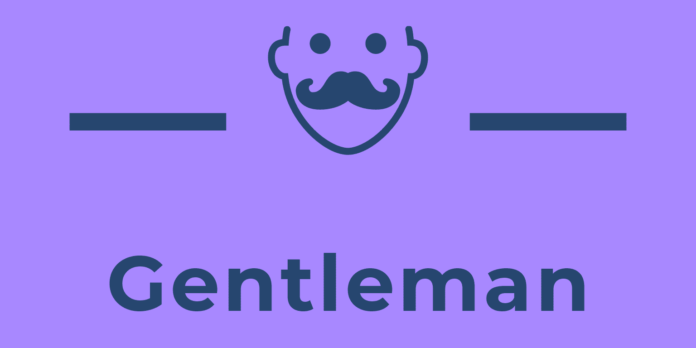

# Gentleman

為紳士打造的 Chrome extension，讓紳士們安心地在午夜時享受屬於自己的時光。

## Features

### Quick Jump

如果每次看到[神的語言](https://twhowto.com/4605/)，都要先複製、然後手動拼湊網址實在是太麻煩了！紳士在重要時刻通常只有一隻手，我們追求的是簡單快速，透過以下兩種方式即可使用 `quick jump` 功能：

1. 對著神的六位數字點擊右鍵開啟下拉選單，選擇 `Gentleman`。
2. 在 Chrome 網址列輸入 `g` 後按下 `tab` 建，並且輸入神的六位數字。

TODO: image here

### Quick Close All NSFW Tabs

想想以下情境：你在媽媽走進來房間時，你慌張的關閉整個視窗，於是媽媽便會很好奇的你的桌面到底是多有趣；或當你成為聖賢時，你必須慢慢的關閉成堆你已經不感興趣的分頁（沒有那種世俗的慾望.jpg）。這種尷尬的情況下，這個功能就是你的好朋友！在 Mac 上按下 `Command-Shift-K`，Windows 上 `Ctrl-Shift-K` 即可關閉所有 NSFW 分頁！

TODO: Image here

NSFW Website list 列在：[./src/background.js#8](./src/background.js#8)，未來會加上使用者自行客製化的功能。

## Future Roadmap

- [ ] Restore closed NSFW tabs
- [ ] Clean NSFW website history
- [ ] User can customized NSFW website list

## LICENSE

